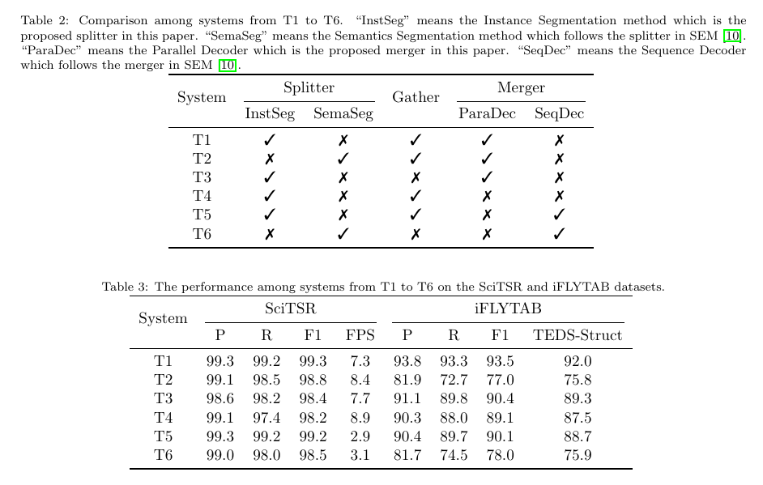

# SEMv2: Table Separation Line Detection Based on Instance Segmentation  

This repository contains the source code of SEMv2: [SEMv2: Table Separation Line Detection Based on Instance Segmentation](https://arxiv.org/abs/2303.04384).

## Introduction


In this work, we adhere to the principle of the split-and-merge based methods and propose an accurate table structure recognizer, termed SEMv2 (SEM: Split, Embed and Merge). Unlike the previous works in the “split” stage, we aim to address the table separation line instance-level discrimination problem and introduce a table separation line detection strategy based on conditional convolution. Specifcally, we design the “split” in a top-down manner that detects the table separation line instance frst and then dynamically predicts the table separation line mask for each instance. The final table separation line shape can be accurately obtained by processing the table separation line mask in a row-wise/column-wise manner. 


## Dataset


**iFLYTAB** collects table images of various styles from different scenarios. Specifcally, we collect both wired and wireless tables from digital documents, and camera-captured photos.
It is worth noting that we also hold a table structure recognition challenge based on the proposed iFLYTAB dataset, which is available at http://challenge.xfyun.cn/topic/info?type=structure. This competition is organized by the iFLYTEK company in conjunction with China Society of Image and Graphics (CSIG).
The training set and validation set can be downloaded from [this website](https://rec.ustc.edu.cn/share/ff5e1160-89f0-11ee-9e05-79b61e968fb7). The annotations for the validation set are located in the `evaluation/validation_annotation` folder.

**iFLYTAB-DP** selects 322 images from the iFLYTAB validation dataset. To minimize the influence of visual cues such as table lines, which could assist the model’s predictions, images of wireless tables were specifically chosen. The selection criteria primarily focus on the presence of extensive textual descriptions within the cells. The dataset IDs are aligned with iFLYTAB and stored in ML_list.txt.


## Metric

We use both F1-Measure [1] and Tree-Edit-Distance-based Similarity (TEDS) [2] metric, which are commonly adopted in table structure recognition literature and competitions, to evaluate the performance of our model for recognition of the table structure. The evaluation code can be found in in the `evaluation/eval.py` file.

[1] [M. Hurst, A constraint-based approach to table structure derivation, in: ICDAR, 2003.](https://ieeexplore.ieee.org/document/1227792)

[2] [X. Zhong, E. ShafeiBavani, A. Jimeno Yepes, Image-based table recognition: Data, model, and evaluation, in: ECCV, 2020.](https://www.ecva.net/papers/eccv_2020/papers_ECCV/papers/123660562.pdf)

## Performance
We perform comprehensive experiments on the SciTSR, PubTabNet, cTDaR, WTW and the proposed iFLYTAB dataset to verify the effectiveness of SEMv2.

- Ablation Study



- SciTSR and PubTabNet


- cTDaR TrackB1-Historical and WTW


- iFLYTAB


## Requirements

```shell
pip install requirements.txt
```

## Training

```shell
cd SEMv2
python runner/train.py --cfg default
```

## Citation

If you find SEMv2 useful in your research, please consider citing:

```
@misc{
  zhang2023semv2,
  title={SEMv2: Table Separation Line Detection Based on Conditional Convolution}, 
  author={Zhenrong Zhang and Pengfei Hu and Jiefeng Ma and Jun Du and Jianshu Zhang and Huihui Zhu and Baocai Yin and Bing Yin and Cong Liu},
  year={2023},
  eprint={2303.04384},
  archivePrefix={arXiv},
  primaryClass={cs.CV}
}
```